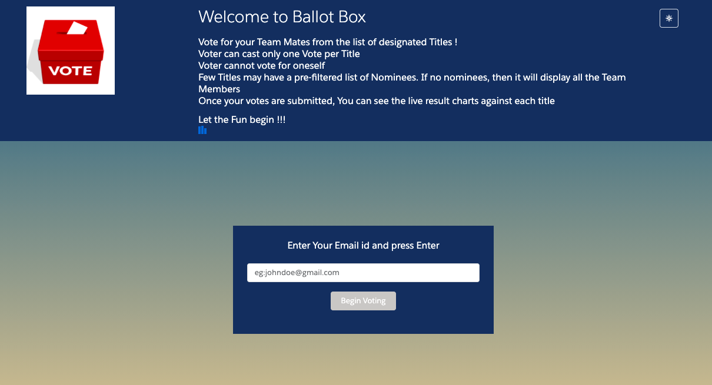
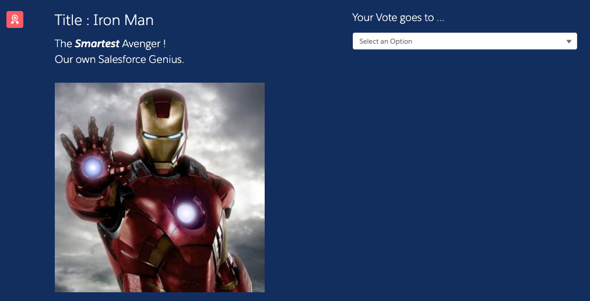
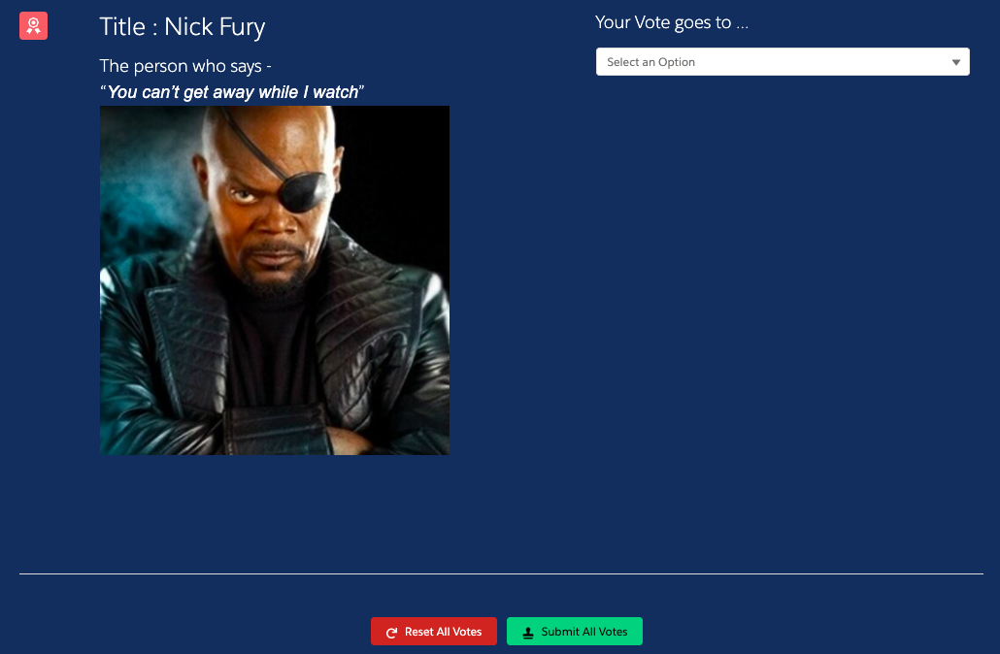
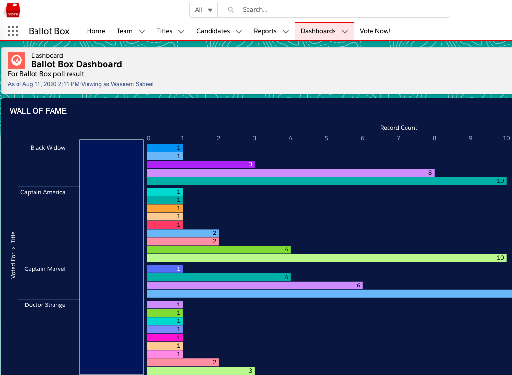
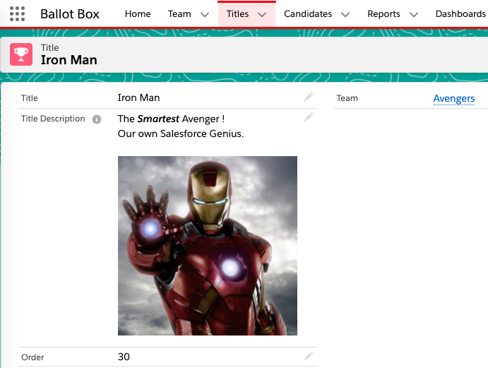

## Ballot Box

A Lightning Web Component App for carrying out Voting among a Team. Exposed as a Public Site in Salesforce
---

## App Highlights

This fun App provisions an Admin to create a Team with relevant Candidates who can Vote among themselves on Titles-
All built on Salesforce!

This App, when exposed as a public Salesforce Site, allows Users to cast their Vote using their configured Email Id in the Candidate records, *without any Login hassle!*








The pre-built Voting rules are - 
- Voter can cast only one Vote per Title
- Voter cannot vote for oneself in any of the Titles
- Few Titles may have a pre-filtered list of *Nominees*, others will display all the Team Members

Our recommendation is to share the Public Salesforce Site URL with the Users all at once to ensure Simultaneous Votes are being cast.
After submitting their Vote, voters can see the Live Ballot Result charts against each Title. These get polled every 4 seconds and updates the charts accordingly in real-time, as shown below-


Along with above result sharing, Salesforce Admin can also view the results in a Wall of Fame Ballot Box Dashboard as shown below - 



---

## Installation & Site Setup

The Setup steps are as below- 
1. Either Install [this Unmanaged Package](https://login.salesforce.com/packaging/installPackage.apexp?p0=04t1U0000058aBE) into your Salesforce Org, or follow below Deployment Steps.
2. In App Launcher, select the **Ballot Box** app to view the Tab contents and create a Team record first, followed by Titles and Candidates. Remember to create Team Candidate records with a Unique Email ID that they will use in the Public Site to determine their voter identity.
3. Create Data Records - Team , Team Candidates, Team Titles as shown below- 





4. If needed, you can create few Nominee records under the Titles so that only they show up as options during Voting and not All the Team Candidates. If no nominees created, then by default, All Candidates will be in the options list for That Title.
5. You can preview how your configured data looks to an end user (Voter with a Candidate email) in the **Vote Now!** tab.
6. As an Admin, Configure the Salesforce Site in your Salesforce Org as instructed separately below.

###  Site Setup

1. As a Salesforce Admin, Navigate to Setup-> Sites
2. If you do not already have a domain name, you'll be prompted to register a domain name first for your Site.


You can enter your preferred value (say *myballotbox*) & check availability for your domain name and register it.
If you already have a domain name, click on New button.

3. On the New Site form, give it a Site label & name (say *MyBallotBoxSite*) and in the Default Web Address, form your site URL (say *votenow*)
4. Mark the Active checkbox True and for the Active Site Home Page, search and select **wbb_votepage** Visualforce page. This page contains the created LWC to be used for Site
5. Keep all other settings as default and Save your new Site.
Based on your values, Your site URL will look something like this- 
```https:// myballotbox-developer-edition.na##.force.com/votenow```
6. On the created Site, click on **Public Access Settings** to grant access to your Site's Guest Profile.
7. Under Profile's Apex Class Access, grant access to *wbb_VoteController* Class
8. Under Profile's Visualforce Page Access, grant access to *wbb_votepage* VF page
9. Under Profile's Object Settings, give **Read, View All** access for Candidate, Nominee, Team & Title Objects. Grant All Read FLS.
9. Under Profile's Object Settings, give **Read, Create, Edit** for Vote Object. Grant All Read & Edit FLS.
10. Preview your Site and try casting Votes as guest users now with the appropriate Candidate Email.
11. Once the Site and Records are configured, you can share the Site Link with Voters and let the fun begin ! :sparkles:

### Deployment

If you are unable to Install [this Unmanaged Package](https://login.salesforce.com/packaging/installPackage.apexp?p0=04t1U0000058aBE), then you can manually deploy the contents of this repository in your Developer Edition Org or a Sandbox-

1. Clone this repository in your local machine:

    ```
    git https://github.com/sfwiseguys/BallotBox
    cd BallotBox
    ```

2. Authorize your org and provide it with an alias (example **mydevorg** in the command below):

    ```
    sfdx force:auth:web:login -s -a mydevorg
    ```

3. Run this command in a terminal to deploy this app in your Org

    ```
    sfdx force:source:deploy -p force-app
    ```

4. If your org isn't already open, open it now using this command:

    ```
    sfdx force:org:open -u mydevorg

    ```

5. Post deployment, you can configure the Salesforce Site manually and set up the Data Records as instructed above and let the voting begin!

---

## Authors

* **Waseem Ali Sabeel** - *Ballot Box components* - [@WaseemAliSabeel](https://github.com/WaseemAliSabeel) :cowboy_hat_face:

---

## Support

Reach out at one of the following places!

- Website at [sfwiseguys.wordpress.com](https://sfwiseguys.wordpress.com) :tophat:
- Twitter at [@sfwiseguys](https://twitter.com/sfwiseguys)
---

## License

This project is licensed under the MIT License - see the [LICENSE.md](LICENSE.md) file for details
- **[MIT license](http://opensource.org/licenses/mit-license.php)**
